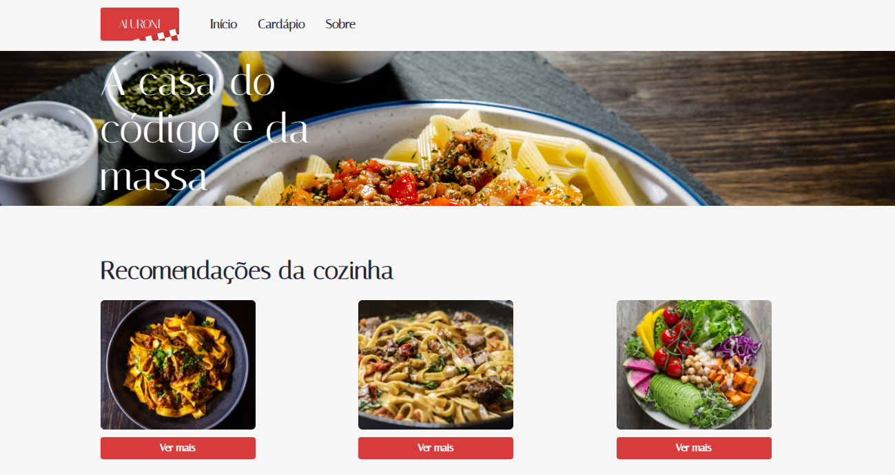
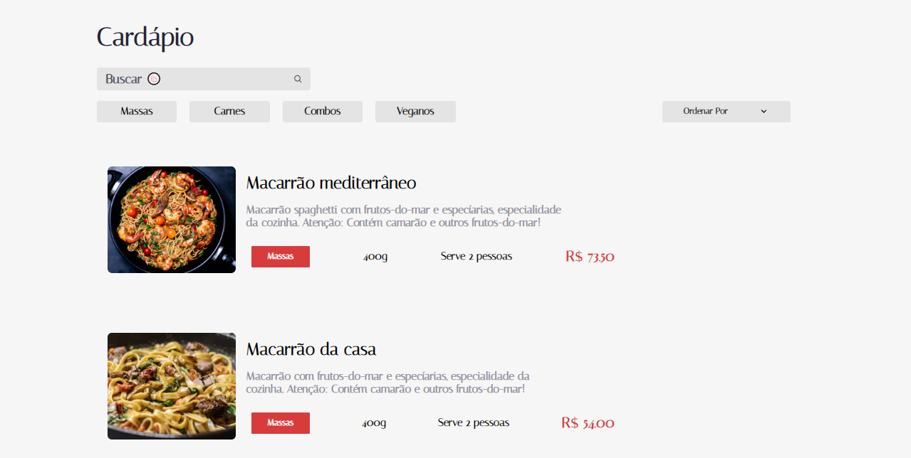
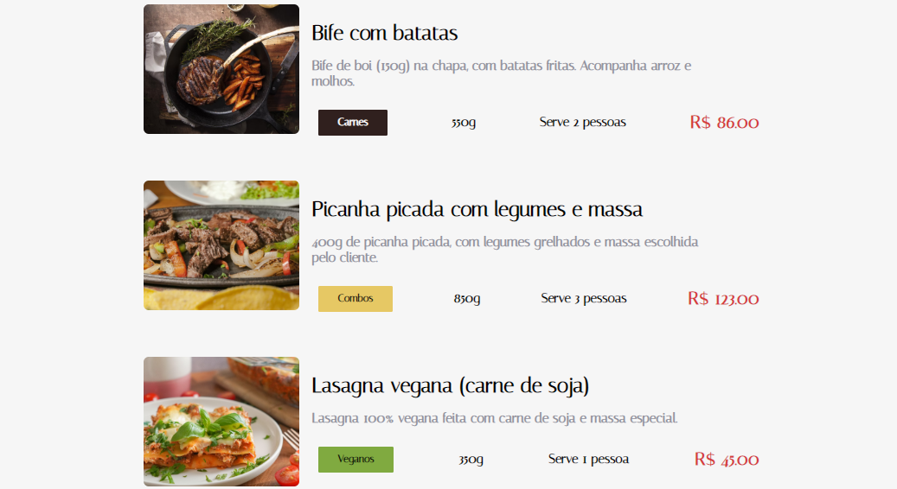

<p align="center">
  
</p>

# **Aluroni** 🥡🍝

## 💻 Interface Web!

<p>
  
  
  
</p>

---

## 🔎 Tecnologias usadas:

Esse projeto foi feito usando essas tecnologias:

- [Typescript](https://www.typescriptlang.org/)

- [ReactJS](https://reactjs.org/)

- [ESLint](https://eslint.org/)

- [SASS](https://sass-lang.com/)

---

## 🎬 Como rodar o projeto:

```bash
# Clone no repositório com o comando:
$ git clone https://github.com/matheuscarvalheira/Aluroni.git

#Entre no diretório:
$ cd aluroni
```

```bash
# Instalar dependências:
$ npm install

# Rodar a aplicação:
$ npm run start
```

🎯 Agora é só ir em: http://localhost:3000/ para ver os resultados em tela.
